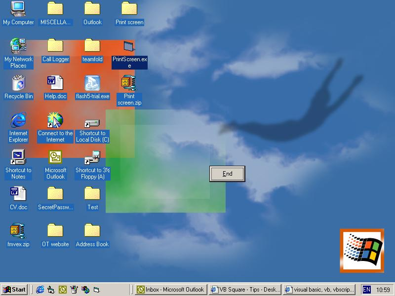



## Print the screen

### Description

This code takes a screendump of your screen and puts it on the form. This can be used to make a form look transparent (although its not) or fool the user into thinking they're still looking at their screen but they're not, they're looking at a picture of their screen. Only half a page of code. The screen-shot below should prove useful. Feel free to comment.

Enjoy........
 
### More Info
 

             |
---                |---
**Submitted On**   |2000-09-28 10:56:36
**By**             |[Toby Gunston](https://github.com/Planet-Source-Code/PSCIndex/blob/master/ByAuthor/toby-gunston.md)
**Level**          |Intermediate
**User Rating**    |5.0 (15 globes from 3 users)
**Compatibility**  |VB 6\.0
**Category**       |[Graphics](https://github.com/Planet-Source-Code/PSCIndex/blob/master/ByCategory/graphics__1-46.md)
**World**          |[Visual Basic](https://github.com/Planet-Source-Code/PSCIndex/blob/master/ByWorld/visual-basic.md)
**Archive File**   |[CODE\_UPLOAD102369282000\.zip](https://github.com/Planet-Source-Code/toby-gunston-print-the-screen__1-11730/archive/master.zip)

